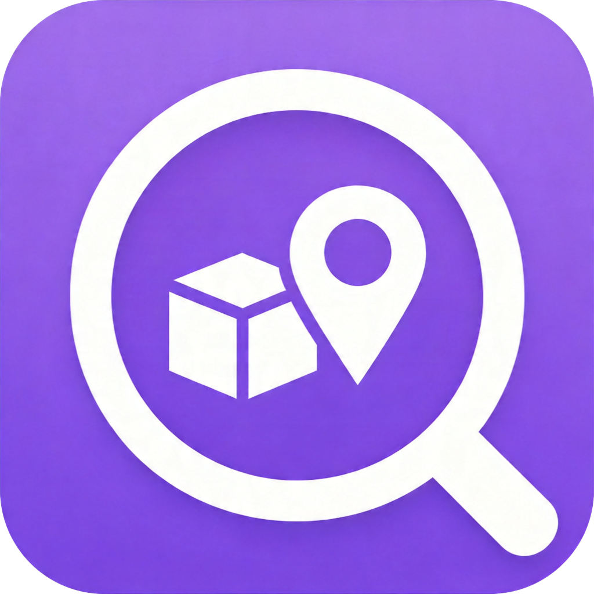

# Wherer

<p align="center">
  
</p>

<p align="center">
  <b>你的私人物品收纳管家</b><br>
  记录每一件物品的位置，告别找不到东西的烦恼。
</p>

<p align="center">
  <a href="https://github.com/Kane-Chu/wherer/releases">
    
  </a>
  
  
  
</p>

---

## 简介

**Wherer**（放哪了）是一款专为 iPhone 设计的物品管理应用。通过空间分类、拍照记录和快速搜索，帮你轻松管理家中或办公室的各类物品。无论是换季衣物、电子设备还是重要文件，打开 Wherer 就能知道它"放哪了"。

## 功能特性

- **空间管理**：支持卧室、书房、客厅、储物间等多种空间分类，自定义颜色和图标
- **物品记录**：添加物品名称、位置、类型和标签，支持多张照片上传
- **封面设置**：为多张物品照片设置封面，物品列表展示更直观
- **沉浸式详情页**：全屏封面大图 + 毛玻璃悬浮按钮，支持左右滑动浏览多图
- **卡片式编辑页**：清爽的白色圆角卡片分组布局，标签实时预览为胶囊样式
- **图片预览**：点击照片进入全屏预览，支持捏合缩放和双击放大
- **快速搜索**：通过名称、位置或标签快速定位物品
- **按空间浏览**：进入空间详情页，查看该空间下的所有物品
- **最近添加**：首页展示最新添加的物品，方便快速回顾
- **iCloud 同步**：基于 Core Data + CloudKit，数据可在你的 Apple 设备间同步

## 应用截图

<p align="center">
  
</p>

> 更多设计稿请参考仓库根目录下的 `wireframe.html` 及 `wireframe_*.png`。

## 技术栈

- **语言**：Swift 5
- **框架**：SwiftUI
- **数据持久化**：Core Data + CloudKit
- **最低系统版本**：iOS 17.0
- **构建工具**：Xcode + `project.yml`（XcodeGen）

## 项目结构

```
Wherer/
├── Models/              # 数据模型（Space、Item、Category 等）
├── ViewModels/          # 状态管理（SpaceStore、ItemStore）
├── Views/               # SwiftUI 视图
│   ├── Spaces/          # 空间相关页面
│   ├── Items/           # 物品相关页面
│   ├── Shared/          # 通用组件（搜索栏、表单、图片预览等）
│   └── Components/      # 首页组件（最近添加）
├── Services/            # 业务服务（PhotoService、SearchService）
├── Persistence/         # Core Data 模型和持久化配置
├── Preview Content/     # 预览资源
└── WhererApp.swift      # 应用入口

WhererTests/             # 单元测试
```

## 本地运行

### 前置要求

- macOS 14+
- Xcode 15+
- iOS 17.0+ 真机或模拟器

### 运行步骤

1. 克隆仓库到本地

```bash
git clone https://github.com/Kane-Chu/wherer.git
cd wherer
```

2. 使用 Xcode 打开工程

```bash
open Wherer.xcodeproj
```

> 如果 `.xcodeproj` 文件不存在或需要重新生成，请确保已安装 [XcodeGen](https://github.com/yonaskolb/XcodeGen)，然后执行：
> ```bash
> xcodegen generate
> ```

3. 选择目标设备或模拟器
4. 点击 `Cmd + R` 编译并运行

### 所需权限

- **相机**：用于拍摄物品照片（`NSCameraUsageDescription`）
- **相册**：用于从照片库选择物品图片（`NSPhotoLibraryUsageDescription`）

## 项目文档

项目技术文档位于 `.docs/` 目录下，面向客户交付：

| 文档 | 说明 |
|------|------|
| `.docs/FSD.md` | 功能规格说明书 |
| `.docs/详细设计.md` | 系统架构与数据模型详细设计 |
| `.docs/用户手册.md` | 最终用户操作指南 |
| `.docs/测试案例.md` | 功能测试用例（28条） |

## 测试

项目包含单元测试和 UI 自动化测试：

**单元测试**（覆盖模型、搜索服务和 Store 逻辑）：
```bash
Cmd + U
```

**UI 自动化测试**：
```bash
./run-ui-tests.sh
```

UI 测试支持自动生成截图，截图保存在 `.screenshots/` 目录。

## 版本历史

详见 [CHANGELOG.md](CHANGELOG.md)。

## 贡献

欢迎提交 Issue 和 Pull Request。

## 开源协议

[MIT License](LICENSE)
